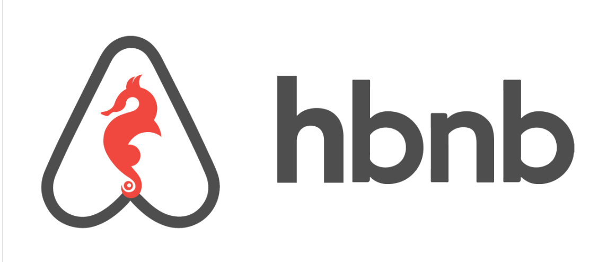

AirBnB Clone Project

Project Description
The goal of this project is to create a complete website application which is composed of:

A command interpreter to manipulate data without a visual interface, like in a Shell (perfect for development and debugging)

A website (the front-end) that shows the final product to everybody: static and dynamic

A database or files that store data (data = objects)

An API that provides a communication interface between the front-end and your data (retrieve, create, delete, update them)

Description of the command interpreter:
This is exactly the same as the Bash shell but limited to a specific use-case solely defined for the purposes of the usage of the AirBnB website. In this case, we want to be able to manage the objects of our project:

This command line interpreter serve as alternative to frontend where user can interact with the backend which was developed using the Python Objects-Oriented Programming

Thus, the following action can be performed;

Create a new object (ex: a new User or a new Place)

Retrieve an object from a file, a database etc…

Do operations on objects (count, compute stats, etc…)

Update attributes of an object

Destroy an object

How to start interact
This instruction will guide you on how to get this project up and running on your local machine for development and testing purposes

Installing
You will need to clone the repository of the project from Github. This will contain the command line program and all of its dependencies.
